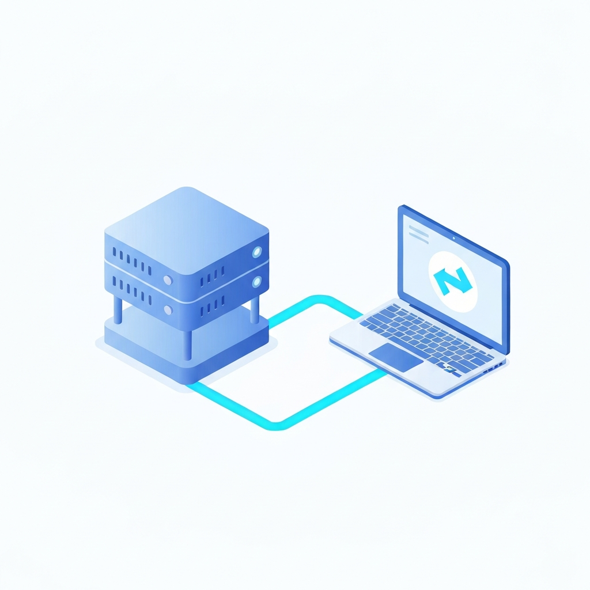

# Calling Google Cloud Services from Claude Code

**How to use Gemini, Google Maps, and image generation from a coding agent — the why, the gotchas, and code that actually runs.**

**Published:** <time datetime="2026-06-10">2026-06-10</time>  ·  **Author:** [Rick Watson](https://www.rmwcommerce.com/), Principal, RMW Commerce Consulting  ·  **Canonical URL:** [`github.com/watsonrm/rmwcommerce/blob/main/guides/google-cloud-from-claude/index.md`](https://github.com/watsonrm/rmwcommerce/blob/main/guides/google-cloud-from-claude/index.md)

> © 2026 Rick Watson / RMW Commerce Consulting. All rights reserved on original commentary. Quoted material is the property of its respective owners and used under fair use with attribution — see [Sources & Attribution](#sources--attribution). Republishing in whole or in substantial part requires written permission: rick@rmwcommerce.com.

---

## TL;DR — what's in it for you

- Your "free Gemini in Google Workspace Business" gives you zero API access — it is an end-user assistant entitlement, not a quota you can call from code. Understanding this distinction saves hours of confusion.
- From Claude Code you can call Gemini (text + vision), Imagen 4 (image generation), and Google Maps Platform (geocoding, static maps, routes) — each through a different door, each billed independently.
- Vertex AI is usually the right Gemini path if you already run GCP: it bills through your existing billing account, trains on nothing, and requires no new long-lived key.
- The infrastructure around the API calls (credentials, state, cloud vs. local) is the part that determines whether a system works unattended. The API calls themselves are the easy 10%.

### Where to spend your time, in priority order

| # | Practice | Why it matters | Effort |
|---|---|---|---|
| 1 | Use Vertex AI (not a Developer API key) for anything touching real data | Free-tier AI Studio trains on inputs; Developer API has separate billing that can 429 even with GCP billing enabled | 15 min |
| 2 | Store every key in the Keychain, never in a script or prompt | One exposed key in a commit history invalidates all work done to contain it | 5 min |
| 3 | Enable each API explicitly on the GCP project before calling it | A valid key still returns 403 until you turn on the specific service | 2 min |
| 4 | Decide once what runs locally vs. in the cloud | Overnight + weekend coverage requires cloud; forcing cloud for everything adds cost with no benefit | 30 min |
| 5 | Don't hardcode model IDs — ask the API and pin deliberately | Model IDs are the most perishable fact in any AI guide; a hardcoded table rots in weeks | 5 min |

Most readers should fix the first three and stop. The cloud architecture question (#4) only matters once you need unattended execution.

---

## How to use this

The operational form of this guide is the Claude Code skill at [`skills/google-cloud-from-claude/`](../../skills/google-cloud-from-claude/). Install it once:

```bash
# from a clone of this repo
mkdir -p ~/.claude/skills && cp -r skills/google-cloud-from-claude ~/.claude/skills/
```

Then describe your Google Cloud setup or situation to Claude — which services you're trying to reach, which auth path you're on, what broke — and say one of these:

> "which door should I use for this Google API call"
> "help me set up Gemini access on Vertex"
> "audit my Google Cloud credential setup"
> "why is my Gemini API key returning 429"

Claude will load the skill and walk you through the right path for your situation. The article below is the reasoning — read it for the *why*; the skill is the *how*.

---

## The confusion worth clearing up first

There are two things named "Gemini," and the only thing they share is the brand.

**Gemini the app** is what your Google Workspace Business subscription includes. It is the assistant in the Gmail/Docs/Sheets side panel, "Help me write," automatic meeting notes, the standalone chat app, NotebookLM. It is consumed by humans, through Google's own interfaces. Google's admin documentation enumerating these features does not mention API keys, API access, or programmatic integration anywhere — because there is none. The same is true of consumer Google AI Pro/Ultra chat subscriptions: chat products, no API access. ([Google admin docs on Workspace Gemini features](https://knowledge.workspace.google.com/admin/generative-ai/workspace-with-gemini/gemini-ai-features-now-included-in-google-workspace-subscriptions))

**Gemini the API** is what you call from code. It is provisioned separately, billed separately, and has nothing to do with how many Workspace seats you own.

If you take one thing from this guide: the Gemini *app* is a product you use; the Gemini *API* is a product you build on. They are not connected, and no amount of the former unlocks the latter.

---

## Three doors to Google from a coding agent

"Calling Google from Claude Code" actually means three different things, and people conflate them.

**Door 1 — MCP servers (act as yourself in Workspace).** This is what most Claude Code users already touch. An MCP server holds an OAuth token for your Google account and exposes tools — read a Doc, search Drive, list calendar events, draft an email. You are not calling a model; you are reading and writing your own Workspace data. This door needs no Gemini API and no billing. It is the right tool when the job is "look at my actual files."

**Door 2 — the Gemini API (call the model from code).** This is a model endpoint: send text and images, get back text or generated images. Two ways in (AI Studio key vs. Vertex AI), covered below. This is what you reach for when you want a second model in the loop — a cheap classifier, a vision call to read a scanned PDF, an image generator.

**Door 3 — plain Google Cloud APIs (Maps and friends).** Geocoding, Places, Static Maps, Routes. Ordinary REST endpoints, authenticated with an API key, each with its own free tier. No model involved.

Underneath all three sits the **infrastructure layer** — Cloud Run, Cloud Scheduler, Secret Manager, Cloud Storage — which is how you make any of this run on a schedule without your laptop being awake. That is the part most "call Gemini from code" tutorials skip, and it is the part that actually matters in production.

---

# Part 1 — The why (for everyone)

## Why call Google from a coding agent at all

A coding agent is good at orchestration and reasoning over your context. It is not the right tool for everything:

- It cannot natively turn an address into coordinates, or render a map. Maps Platform does that in one call.
- A vision call to read a scanned invoice, or a cheap fast model to classify 200 inbound messages, is often better delegated to a purpose-built model than done in the main loop.
- Image generation is its own model entirely.

The pattern is: the agent stays in charge, and it calls out to Google services for the narrow things they do better or cheaper. The interesting engineering is not the API call — it is everything around it.

## The local-versus-cloud story (a real setup, anonymized)

Here is the shape of a working system that leans on Google Cloud. It runs a set of "fetchers" — small jobs that poll external systems (a meeting-transcript service, Slack, Gmail, a shared Drive folder) and file what they find into a knowledge base the agent reads.

The first version ran entirely on a Mac, as scheduled local jobs (`launchd`). It worked until the obvious flaw surfaced: **the Mac is asleep overnight and on weekends**, so ingestion stopped exactly when it was most convenient to let it run. That single constraint drove the whole architecture:

- **Cloud Run Jobs** run the fetchers 24/7, triggered by **Cloud Scheduler** on a cron. In aggregate, these jobs cost **under a dollar a month** — they are small and the free tiers are generous.
- **Cloud Storage** holds the durable state (the "last processed" cursor for each fetcher) and the queue of items waiting to be processed. Cloud Run containers are ephemeral; they keep nothing locally, so state has to live somewhere durable. Writes use a generation-precondition guard so two overlapping runs can't overwrite each other.
- **Secret Manager** holds the credentials the cloud jobs need. The *source of truth* for every secret stays in the macOS **Keychain**; Secret Manager is seeded from it once at deploy time. The same Python reads a credential from an environment variable when running in Cloud Run, and falls back to the Keychain when running locally — one code path, two environments, no duplication.
- A small **Cloud Run service — a "secret proxy"** — solves a specific problem: scheduled cloud agents have no secure way to hold credentials in their prompt. So instead of pasting tokens anywhere, the proxy holds the credentials in Secret Manager and exposes a handful of narrow, intent-specific HTTPS endpoints. Agents call it with a single bearer token. Rotate or revoke a credential in one place; nothing leaks into a prompt.

The lesson: **the API calls are the easy 10%.** The 90% is credentials that never touch a prompt, state that survives a restart, and a clear rule about what runs locally versus in the cloud. What stayed local in this setup — local-model search indexing, file routing — stayed local on purpose, because moving it would have added real cost and complexity for no benefit.

## The economics

The whole cloud footprint above runs for **under $1/month**: Cloud Run jobs well inside the free tier, Cloud Scheduler free at this volume, pennies of Cloud Storage, negligible Secret Manager. The thing that would cost real money is running large-model inference on a schedule — which is exactly why you decide deliberately what to send to a model and what to keep as plain code.

---

# Part 2 — The how (for the terminal crowd)

Everything below was run from a terminal on 2026-06-10. Where a number is version-sensitive (model IDs, prices), the guide says so and shows you how to ask Google for the current answer rather than trusting a table that will rot.

## Getting Gemini access: two doors

### Door A — Google AI Studio key (the fast path)

Go to [aistudio.google.com](https://aistudio.google.com), click **Get API key**. No credit card to start. You get a string beginning `AIza…`. Send it as the `x-goog-api-key` header.

Two things to know before you trust it with anything real:

1. **The free tier trains on you.** On the free tier, your prompts and outputs are used to improve Google's products. On the paid tier, they are not. This is the single biggest reason not to put client or confidential data through a free-tier key. ([pricing & data-use](https://ai.google.dev/gemini-api/docs/pricing))
2. **Rate limits are per Google Cloud project, not per key.** Generating extra keys in one project adds no quota. ([rate limits](https://ai.google.dev/gemini-api/docs/rate-limits))

### Door B — Vertex AI (the path to prefer if you already run GCP)

Vertex AI is the same models, reached through your Google Cloud project. The differences that matter:

- **Auth is your GCP identity**, not a long-lived key — a service account, or your own `gcloud` credentials via Application Default Credentials. Nothing new to store or leak.
- **It bills through your GCP billing account** (pay-as-you-go), and never trains on your data.
- You get IAM, audit logging, VPC controls, and regional data residency if you need it. ([Vertex AI data residency](https://docs.cloud.google.com/gemini-enterprise-agent-platform/resources/data-residency))

### A real gotcha, encountered live

While writing this, the Developer-API path (Door A, but with a key minted inside a billing-enabled GCP project) returned:

```
429 RESOURCE_EXHAUSTED — "Your prepayment credits are depleted."
```

The lesson: **enabling the API and having GCP billing on is not always sufficient.** The Gemini *Developer* API has its own billing, configured in AI Studio (and in some accounts it is prepaid — buy credits up front). A zero balance there returns `429` no matter how healthy your GCP billing account is.

**Vertex AI had no such issue** — it bills through the GCP billing account directly. So if you already run a Google Cloud project with billing, Vertex is very likely the path of least resistance. That is the path the rest of this guide uses for Gemini. ([Developer API vs. Vertex](https://ai.google.dev/gemini-api/docs/migrate-to-cloud))

### Enabling everything from the command line

If you have `gcloud` installed and authenticated, you do not need to click around the console. Enable the APIs and (for Maps) mint a restricted key in a few commands:

```bash
PROJECT=your-project

# Enable the model + maps APIs
gcloud services enable \
  aiplatform.googleapis.com \
  generativelanguage.googleapis.com \
  geocoding-backend.googleapis.com \
  static-maps-backend.googleapis.com \
  places-backend.googleapis.com \
  routes.googleapis.com \
  apikeys.googleapis.com \
  --project "$PROJECT"

# Mint a Maps key, restricted to only the Maps APIs it needs
gcloud services api-keys create \
  --display-name="claude-code-maps" \
  --api-target=service=geocoding-backend.googleapis.com \
  --api-target=service=static-maps-backend.googleapis.com \
  --api-target=service=places-backend.googleapis.com \
  --api-target=service=routes.googleapis.com \
  --project "$PROJECT"
```

`api-keys create` returns an operation; list the keys and pull the secret string:

```bash
gcloud services api-keys list --project "$PROJECT" \
  --format="table(displayName,name)"

gcloud services api-keys get-key-string \
  projects/PROJECT_NUMBER/locations/global/keys/KEY_UID \
  --format="value(keyString)"
```

## Store keys in the Keychain, never hardcode

```bash
# store once
security add-generic-password -U -s gmaps-api-key -a "$USER" -w 'AIza...'

# read in any script
export GMAPS_API_KEY="$(security find-generic-password -s gmaps-api-key -w)"
```

This is the same discipline the production setup uses: the Keychain is the local source of truth; nothing sensitive lands in a script, a prompt, or your shell history.

## Calling Gemini through Vertex (no key to store)

Authenticate with your own gcloud credentials and use a bearer token. The token is short-lived; mint a fresh one per script run.

```bash
PROJECT=your-project
LOC=us-central1
TOKEN=$(gcloud auth print-access-token)

curl -s "https://${LOC}-aiplatform.googleapis.com/v1/projects/${PROJECT}/locations/${LOC}/publishers/google/models/gemini-2.5-flash:generateContent" \
  -H "Authorization: Bearer $TOKEN" \
  -H "Content-Type: application/json" \
  -d '{"contents":[{"role":"user","parts":[{"text":"Summarize this in one sentence: ..."}]}]}'
```

The response carries the text at `candidates[0].content.parts[0].text`. This exact call, asked why the API differs from Workspace Gemini, returned:

> "The API provides programmatic access for developers to build custom applications and integrations, while Workspace Gemini offers embedded AI assistance directly to end-users within productivity apps."

### Vision: hand Gemini an image

Base64-encode a local image and include it as an `inlineData` part:

```bash
IMG_B64=$(base64 -i photo.png)
cat > req.json <<EOF
{"contents":[{"role":"user","parts":[
  {"text":"Describe this image in one sentence."},
  {"inlineData":{"mimeType":"image/png","data":"$IMG_B64"}}
]}]}
EOF

curl -s "https://${LOC}-aiplatform.googleapis.com/v1/projects/${PROJECT}/locations/${LOC}/publishers/google/models/gemini-2.5-flash:generateContent" \
  -H "Authorization: Bearer $TOKEN" -H "Content-Type: application/json" \
  -d @req.json
```

This is the workhorse for reading scanned documents, screenshots, and photos — anything where the data is locked in pixels.

## Image generation: Imagen 4

Imagen uses a `:predict` endpoint. One call, one PNG returned as base64:

```bash
curl -s "https://${LOC}-aiplatform.googleapis.com/v1/projects/${PROJECT}/locations/${LOC}/publishers/google/models/imagen-4.0-fast-generate-001:predict" \
  -H "Authorization: Bearer $TOKEN" -H "Content-Type: application/json" \
  -d '{"instances":[{"prompt":"A clean isometric illustration of a small cloud server linked by a glowing line to a laptop terminal, flat vector style, soft blue palette, white background"}],"parameters":{"sampleCount":1}}' \
  -o out.json

# decode predictions[0].bytesBase64Encoded to a file
python3 -c "import json,base64; d=json.load(open('out.json')); open('img.png','wb').write(base64.b64decode(d['predictions'][0]['bytesBase64Encoded']))"
```

That exact prompt produced this, first try:



Two notes on usage rights: every Google-generated image carries an invisible **SynthID** watermark marking it AI-generated; SynthID does **not** restrict commercial use. Pricing is per-image and tier-dependent (roughly two to six cents for Imagen 4; Gemini's native image models price image output as tokens) — verify against the [live pricing page](https://ai.google.dev/gemini-api/docs/pricing) before quoting a number. ([image generation docs](https://ai.google.dev/gemini-api/docs/image-generation))

Google's native image models (the "Nano Banana" line — `gemini-2.5-flash-image` and newer) are an alternative reached through `generateContent` rather than `:predict`, and are stronger at conversational editing and text-in-image. Same auth, different endpoint shape.

## Picking a model (these move fast — ask the API)

Model IDs are the most perishable fact in any AI guide. Do not trust a hardcoded list; ask your project what it can actually call:

```bash
# AI Studio key path
curl -s "https://generativelanguage.googleapis.com/v1beta/models" \
  -H "x-goog-api-key: $GEMINI_API_KEY" | python3 -m json.tool
```

As of this writing the useful set included: `gemini-2.5-flash` and `gemini-2.5-pro` (stable workhorses), a `gemini-3.x` family (several still `-preview`), `imagen-4.0-*` for images, and `gemini-flash-latest` / `gemini-pro-latest` aliases if you want to track the front edge without editing code. Pin a specific ID in production; re-check the [models page](https://ai.google.dev/gemini-api/docs/models) before you ship.

## Google Maps Platform

Maps is Door 3 — an ordinary API key, its own free tiers, no model. Two calls cover most agent needs.

**Geocoding** (address to coordinates):

```bash
GMAPS_API_KEY="$(security find-generic-password -s gmaps-api-key -w)"
curl -s "https://maps.googleapis.com/maps/api/geocode/json?address=350+5th+Ave,New+York,NY&key=$GMAPS_API_KEY"
# -> "350 5th Ave, New York, NY 10001, USA" {lat: 40.7486, lng: -73.9853}
```

**Static map image** (drop straight into a report or doc):

```bash
curl -s -o map.png "https://maps.googleapis.com/maps/api/staticmap?center=40.7484,-73.9857&zoom=14&size=600x400&markers=color:red%7C40.7484,-73.9857&key=$GMAPS_API_KEY"
```

That produced this, pinning the Empire State Building:


On cost: the old flat $200/month Maps credit ended in March 2025, replaced by **per-service monthly free caps** — on the order of 10,000 free calls/month for the Essentials tier (Geocoding, Static Maps, basic Routes), fewer for richer Places and Routes features. New accounts also get a one-time trial credit. Geocoding runs about $5 per 1,000 calls beyond the free cap; static maps about $2 per 1,000. Confirm against the [Maps Platform pricing page](https://mapsplatform.google.com/pricing/) before relying on a figure. ([March 2025 pricing changes](https://developers.google.com/maps/billing-and-pricing/march-2025))

---

# Part 3 — Wiring it into Claude Code

The cleanest pattern is a thin helper your scripts (and the agent) can call, that reads the right credential from the Keychain and hits the right door. Nothing about it is exotic:

```bash
#!/usr/bin/env bash
# gem.sh — one-shot Gemini text call via Vertex
set -euo pipefail
PROJECT=your-project; LOC=us-central1
TOKEN=$(gcloud auth print-access-token)
curl -s "https://${LOC}-aiplatform.googleapis.com/v1/projects/${PROJECT}/locations/${LOC}/publishers/google/models/gemini-2.5-flash:generateContent" \
  -H "Authorization: Bearer $TOKEN" -H "Content-Type: application/json" \
  -d "{\"contents\":[{\"role\":\"user\",\"parts\":[{\"text\":$(python3 -c 'import json,sys;print(json.dumps(sys.argv[1]))' "$1")}]}]}" \
  | python3 -c "import sys,json;print(json.load(sys.stdin)['candidates'][0]['content']['parts'][0]['text'])"
```

```
./gem.sh "Classify this support email as billing / bug / feature: ..."
```

### Which door, when

- **Reading or writing your own Gmail / Docs / Drive / Calendar** — MCP server (Door 1). Do not reach for the Gemini API for this; it is the wrong tool.
- **Reasoning, classification, extraction, vision, image generation** — Gemini API (Door 2). Vertex if you run GCP and touch real data; AI Studio key for throwaway prototypes.
- **Location, maps, routes** — Maps Platform key (Door 3).

### The two prerequisites people miss

1. **Billing must be enabled** on the project for paid Gemini tiers and for nearly all Maps usage.
2. **Each API must be explicitly enabled** in the project — a valid key still returns `403 API not enabled` until you turn on the specific service. (`gcloud services enable …`, as shown above.)

### Safety checklist

- **Restrict every key** by API and by application (IP allowlist for server-side scripts). One key per purpose.
- **Never** send client or confidential data through a **free-tier AI Studio key** — it trains on your inputs. Use a paid key or Vertex with a service account.
- **Keychain only.** No keys in scripts, prompts, or history.
- **Rotate** keys periodically; revoke immediately if one is exposed.

---

## What this unlocks

Once the plumbing is in place, the agent gains a set of cheap, reliable capabilities it didn't have: it can read a scanned PDF, turn a list of addresses into a map, generate an illustration for a doc, or offload a high-volume classification job to a fast model — all from the same terminal, all billed in pennies, all without a single key sitting in a prompt.

The mental model is the whole game: the Gemini *app* in your Workspace seat is for you to use; the Gemini *API*, Maps, and Imagen are separate products you build on, provisioned and billed on their own. Keep those straight, put credentials in the Keychain, decide deliberately what runs locally versus in the cloud, and the rest is a handful of `curl` calls you can read in an afternoon.

---

## Sources & Attribution

- Workspace Gemini features (Google admin) — https://knowledge.workspace.google.com/admin/generative-ai/workspace-with-gemini/gemini-ai-features-now-included-in-google-workspace-subscriptions
- Gemini Developer API vs. Vertex — https://ai.google.dev/gemini-api/docs/migrate-to-cloud
- Gemini API pricing & data use — https://ai.google.dev/gemini-api/docs/pricing
- Gemini API rate limits — https://ai.google.dev/gemini-api/docs/rate-limits
- Gemini models list — https://ai.google.dev/gemini-api/docs/models
- Image generation (Nano Banana / Imagen) — https://ai.google.dev/gemini-api/docs/image-generation
- Vertex AI data residency — https://docs.cloud.google.com/gemini-enterprise-agent-platform/resources/data-residency
- Maps Platform pricing — https://mapsplatform.google.com/pricing/
- Maps Platform March 2025 pricing changes — https://developers.google.com/maps/billing-and-pricing/march-2025
- Get a Maps API key — https://developers.google.com/maps/documentation/javascript/get-api-key

*All code examples and both generated images were produced live from a terminal on 2026-06-10. Model IDs and prices are version-sensitive — verify against the linked pages before relying on a specific value.*

---

> © 2026 Rick Watson / RMW Commerce Consulting. All rights reserved on original commentary. Quoted material is the property of its respective owners and used under fair use with attribution. Republishing in whole or in substantial part requires written permission: rick@rmwcommerce.com.
